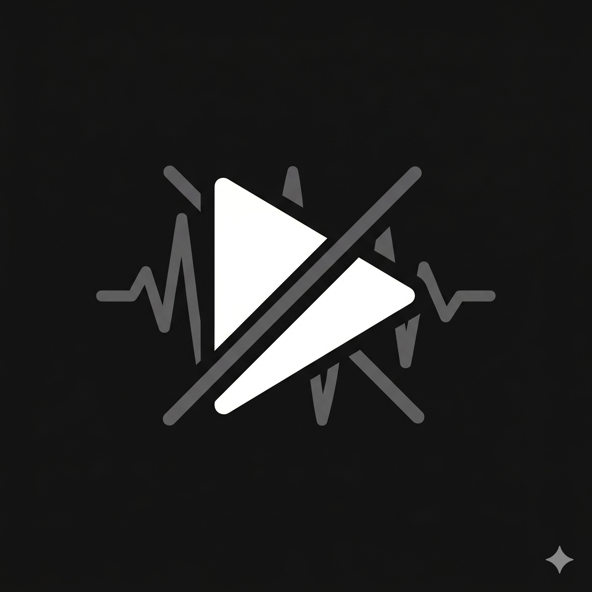
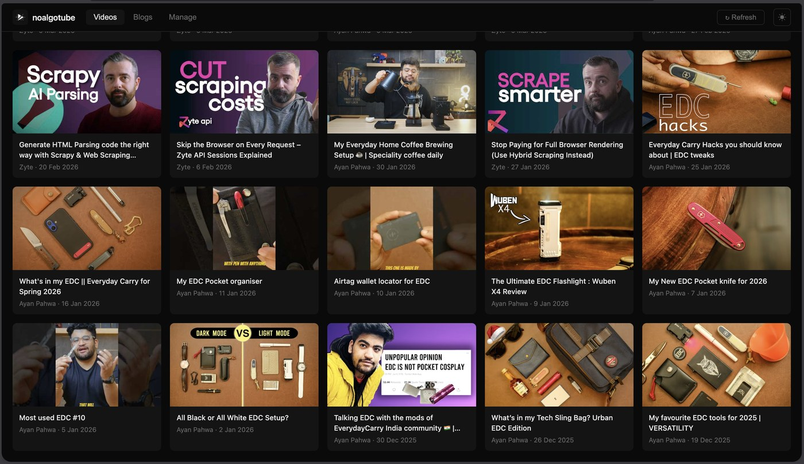
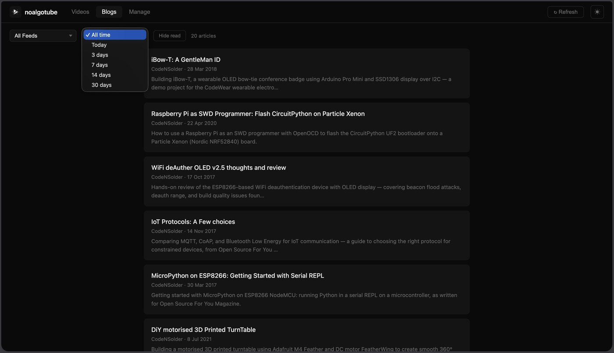
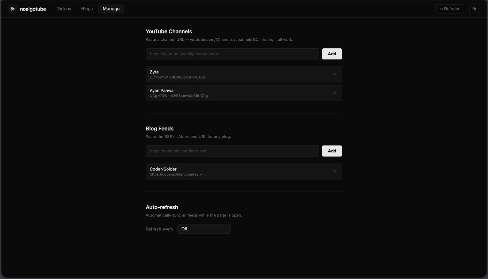

<p align="center">
  
</p>

# noalgotube

A personal content aggregator for YouTube channels and blog RSS feeds. No algorithm, no recommendations, only content from sources you explicitly add.

- **YouTube** — add channel URL (no API key required)
- **Blogs** — follows any RSS/Atom feed for blogs and news sites
- **Self-hosted** — your data stays on your machine or server

## Features

- Add YouTube channels by URL (`@handle`, `/channel/UC...`, `/user/...`)
- Add any blog RSS or Atom feed
- Search videos and articles by title
- Filter by channel / feed or by date range
- Watch videos directly in-app via embedded player — no need to leave the page
- Mark videos as watched, articles as read — unread counts shown on nav tabs
- Grid and list view for videos
- Dark/light theme, persisted per browser
- Auto-refresh on a configurable interval
- Resilient YouTube sync — falls back to yt-dlp automatically when YouTube RSS is unavailable
- Single Docker command to self-host

## Screenshots







---

## Self-hosting

### Option 1 — Docker Hub (recommended, no clone needed)

Pull and run the pre-built image directly:

```bash
docker run -d \
  --name noalgotube \
  --restart unless-stopped \
  -p 8080:8080 \
  -v noalgotube_data:/data \
  iayanpahwa/noalgotube:latest
```

Open [http://localhost:8080](http://localhost:8080). Data is persisted in the `noalgotube_data` volume.

To update to the latest image:

```bash
docker pull iayanpahwa/noalgotube:latest
docker rm -f noalgotube
docker run -d --name noalgotube --restart unless-stopped \
  -p 8080:8080 -v noalgotube_data:/data iayanpahwa/noalgotube:latest
```

### Option 2 — Docker Compose with Docker Hub image

Create a `docker-compose.yml`:

```yaml
services:
  noalgotube:
    image: iayanpahwa/noalgotube:latest
    ports:
      - "8080:8080"
    volumes:
      - noalgotube_data:/data
    restart: unless-stopped

volumes:
  noalgotube_data:
```

Then run:

```bash
docker compose up -d
```

To update:

```bash
docker compose pull
docker compose up -d
```

### Option 3 — Build from source

```bash
git clone https://github.com/iayanpahwa/noalgotube.git
cd noalgotube
docker compose up --build -d
```

### Option 4 — Portainer

1. In Portainer, go to **Stacks → Add stack**
2. Name it `noalgotube`
3. Paste the compose snippet from Option 2 into the web editor
4. Click **Deploy the stack**
5. Open [http://your-host:8080](http://your-host:8080)

To update: go to the stack, click **Editor**, change `latest` to a specific version tag (e.g. `1.0.0`), and redeploy. Or pull the new image and restart the stack.

---

### Expose on a custom port

Change the port mapping in your compose file:

```yaml
ports:
  - "3000:8080"   # host port : container port
```

---

## Local development

**Requirements:** Python 3.12+, [uv](https://github.com/astral-sh/uv).

```bash
cd backend
uv sync          # creates .venv and installs dependencies
uv run uvicorn main:app --reload --port 8080
```

Open [http://localhost:8080](http://localhost:8080).

The frontend is served as static files by FastAPI — no build step needed.

### Without uv

```bash
cd backend
python -m venv .venv
source .venv/bin/activate   # Windows: .venv\Scripts\activate
pip install -r requirements.txt
uvicorn main:app --reload --port 8080
```

---

## Usage

1. **Manage** tab — add YouTube channels or blog RSS feeds
   - YouTube: paste any channel URL (`https://youtube.com/@name`, `/channel/UC...`, etc.)
   - Blogs: paste the RSS/Atom feed URL directly (`https://example.com/feed.xml`)
2. **Videos** tab — browse and watch videos; click a card to open the embedded player
3. **Blogs** tab — browse and read articles; click a card to open the article reader
4. **Search** — type in the search box on Videos or Blogs to filter by title
5. **Refresh** button — manually sync all feeds for new content
6. **Auto-refresh** — configure in Manage to sync automatically while the page is open

## Configuration

Environment variables (set in `docker-compose.yml` or your shell):

| Variable | Default | Description |
|---|---|---|
| `FRONTEND_DIR` | `../frontend` (relative to `main.py`) | Path to the frontend directory |
| `DB_PATH` | `../data/noalgotube.db` | Path to the SQLite database file |

Docker sets `DB_PATH=/data/noalgotube.db` automatically, mounted to the `noalgotube_data` volume.

## Stack

- **Backend:** Python 3.12, [FastAPI](https://fastapi.tiangolo.com), [uvicorn](https://www.uvicorn.org)
- **Database:** SQLite (built-in, no external DB required)
- **RSS:** [feedparser](https://feedparser.readthedocs.io) + [httpx](https://www.python-httpx.org)
- **YouTube fallback:** [yt-dlp](https://github.com/yt-dlp/yt-dlp)
- **Frontend:** Vanilla HTML/CSS/JS — no npm, no build step

## Credits

noalgotube is built on top of several excellent open-source projects:

- **[FastAPI](https://github.com/tiangolo/fastapi)** by Sebastián Ramírez — the backend API framework
- **[feedparser](https://github.com/kurtmckee/feedparser)** by Kurt McKee — RSS/Atom feed parsing
- **[httpx](https://github.com/encode/httpx)** by Encode — async HTTP client
- **[yt-dlp](https://github.com/yt-dlp/yt-dlp)** by the yt-dlp contributors — YouTube fallback when RSS is unavailable
- **[uvicorn](https://github.com/encode/uvicorn)** by Encode — ASGI server

## License

MIT — see [LICENSE](LICENSE).

---

## Changelog

### v1.2.0 — 2026-04-18
- Mark unwatched / Mark unread — toggle watched or read state directly from the card (hover to reveal)
- Mark all watched / Mark all read — clear the entire view in one click; respects the active channel/feed filter
- Delete confirmation — channels and feeds now prompt before deletion to prevent accidental data loss
- Mobile hamburger menu — nav collapses into a ☰ dropdown on small screens; closes on navigate or outside tap
- Internal: persistent SQLite connection with WAL mode for better read/write concurrency
- Fix: `asyncio.get_event_loop()` → `get_running_loop()` (Python 3.10+ deprecation)
- Fix: initial feed sync failure no longer returns 500 on the add-feed endpoint

### v1.1.2 — 2026-04-17
- Fix: items-per-source setting now persists correctly across page refresh
- Fix: browser refresh stays on the same tab (Videos / Blogs / Manage) instead of always going back to Videos

### v1.1.0 — 2026-04-17
- PWA support — installable on Android and iOS home screens, works offline with cached content
- Mobile-optimised UI — bottom-sheet modals, single-column video grid, wrapped toolbar, 44 px touch targets, safe-area insets for notched phones
- Per-channel and per-feed item count — set how many recent videos/articles to show per source (global default + per-source override) in the Manage page
- Blog sort toggle — switch between "Newest first" and "Oldest first" in the Blogs toolbar; preference persisted across sessions

### v1.0.0 — 2026-04-17
- Search bar on Videos and Blogs views (live client-side filter by title)
- Unwatched/unread count badges on Videos and Blogs nav tabs
- yt-dlp fallback for channel resolution and video sync when YouTube RSS is unavailable
- Multi-arch Docker image published to Docker Hub (`iayanpahwa/noalgotube`, amd64 + arm64)
- Docker Hub, Docker Compose, and Portainer deployment instructions
